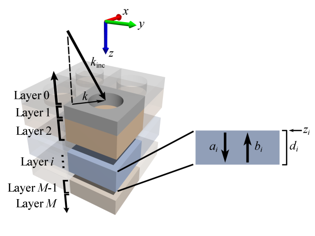

.. S4 documentation master file, created by
   sphinx-quickstart on Tue Dec 31 12:59:38 2013.
   You can adapt this file completely to your liking, but it should at least
   contain the root `toctree` directive.

Introduction to |S4|
====================

What is it?
-----------

|S4| (or simply S4) stands for Stanford Stratified Structure Solver, a frequency domain code to solve the linear Maxwell's equations in layered periodic structures.
Internally, it uses Rigorous Coupled Wave Analysis (RCWA; also called the Fourier Modal Method (FMM)) and the S-matrix algorithm.
The program is implemented using a `Lua <http://www.lua.org/>`_ frontend, or alternatively, as a `Python <http://python.org>`_ extension.
|S4| was developed by `Victor Liu <http://www.stanford.edu/~vkl/>`_ of the `Fan Group <http://www.stanford.edu/group/fan/>`_ in the `Stanford Electrical Engineering Department <http://ee.stanford.edu/>`_.

What can it compute?
--------------------

|S4| can compute transmission, reflection, or absorption spectra of structures composed of periodic, patterned, planar layers.
The electromagnetic fields throughout the structure can also be obtained, as well as certain line and volume integrals.
The spectra obtained from |S4| are extremely smooth, making it easier for local and global optimization.

.. image:: spec.*

Documentation Contents
----------------------

.. toctree::
   :maxdepth: 2
   
   install
   tutorial
   lua_api
   python_api
   units
   faq
   changelog
   dev_info
   license
   citing

Releases
--------

* Version 1.1.1
  
  Latest version using Lua 5.2.x and supports Python.

* Version 1.0
  
  This is the original version that was published in Computer Physics Communications. It requires on Lua 5.1.x and packs Python bindings.

Indices and tables
------------------

* :ref:`genindex`
* :ref:`modindex`
* :ref:`search`

.. |S4| replace:: S\ :sup:`4`
